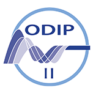
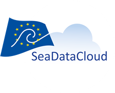
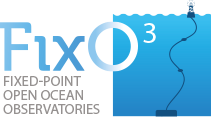
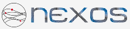

---
# You don't need to edit this file, it's empty on purpose.
# Edit theme's home layout instead if you wanna make some changes
# See: https://jekyllrb.com/docs/themes/#overriding-theme-defaults
---
title: 1. Overview
layout: default
---

# Marine Profiles of the OGC Sensor Web Enablement Standards

## Contents

  
    
    

      <a class="page-link" href="{{ my_page.url | relative_url }}">{{ my_page.title | escape }}</a>
    

    
  

 

## Authors

* Alexandra Kokkinaki, British Oceanographic Data Centre, alexk@bodc.ac.uk
* Simon Jirka, 52°North Initiative for Geospatial Open Source Software GmbH, jirka@52north.org
* Robert Huber, MARUM - University of Bremen
* Matthes Rieke, 52°North Initiative for Geospatial Open Source Software GmbH, m.rieke@52north.org
* Christian Autermann, 52°North Initiative for Geospatial Open Source Software GmbH, c.autermann@52north.org
* **PLEASE ADD YOUR NAME TO THIS LIST!**

## Acknowledgements

The profiles defined in this document have been developed within a series of research projects. Important European projects that supported the profile development comprise:

| Acknowledgements| |
| - | - |
|  | **ODIP 2** (Extending the Ocean Data Interoperability Platform, [http://www.odip.eu]) is funded by the Horizon 2020 Framework Programme for Research and Innovation (H2020-INFRASUPP-2014-2) of the European Union under grant agreement number 654310. |
|  | **SeaDataCloud** ([https://www.seadatanet.org/About-us/SeaDataCloud])  is by the Horizon 2020 Framework Programme for Research and Innovation (H2020-INFRAIA-2016-1) of the European Union under grant agreement number 730960. |
|  | **BRIDGES** (Bringing together Industry for the Development of Glider Environment, [http://www.bridges-h2020.eu]) is funded by the Horizon 2020 Framework Programme for Research and Innovation (H2020-BG-2014-2) of the European Union under grant agreement number 635359. |
|  | **FixO3** (Fixed Point Open Ocean Observatories Network, [http://www.fixo3.eu]) was funded by the Sevenths Framework Programme (FP7) for Research and Innovation (FP7-INFRASTRUCTURES-2012-1-RTD) of the European Union under grant agreement number 312463. | 
|  | **NeXOS** (Next generation, Cost-effective, Compact, Multifunctional Web Enabled Ocean Sensor Systems Empowering Marine, Maritime and Fisheries Management, [http://www.nexosproject.eu]) is funded by the Sevenths Framework Programme (FP7) for Research and Innovation (FP7-OCEAN-2013) of the European Union under grant agreement number 614102. | 
| **AODN** | | 
| **[ENVRIplus](http://www.envriplus.eu/)** | | 
| **[EUROFLEETS/EUROFLEETS2](http://www.eurofleets.eu/np4/home.html)** | | 
| **FRAM** | | 
| **[IOOS](https://ioos.noaa.gov/)** | | 
| **[Jerico/Jerico-Next](http://www.jerico-ri.eu/)** | | 
| **[RITMARE](http://www.ritmare.it/)** | | 
| **[SeaDataNet](http://www.seadatanet.org/)** | | 
| **[SenseOcean](http://www.senseocean.eu/)** | | 
| **[X-DOMES](https://www.earthcube.org/group/x-domes)** | | 
| **TODO: ADD FURTHER Acknowledgements**  | | 
